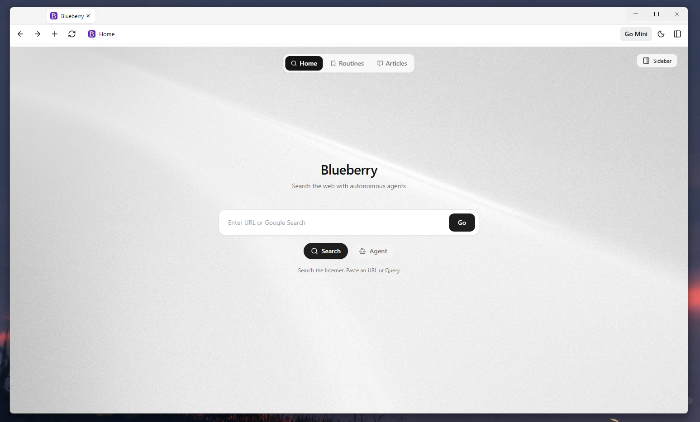
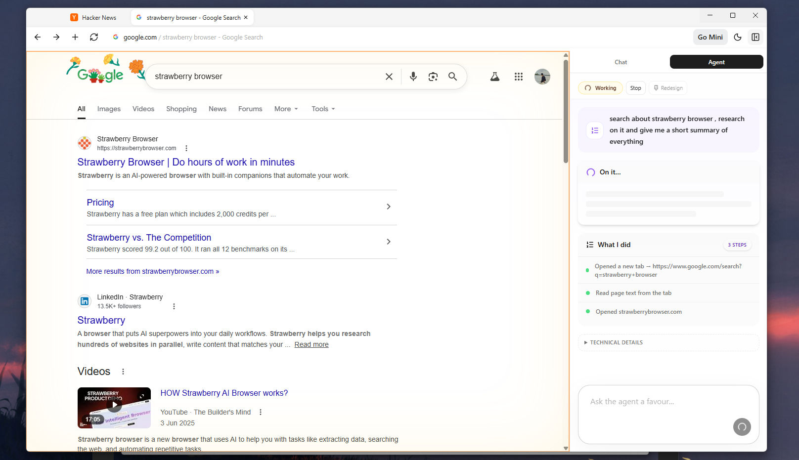
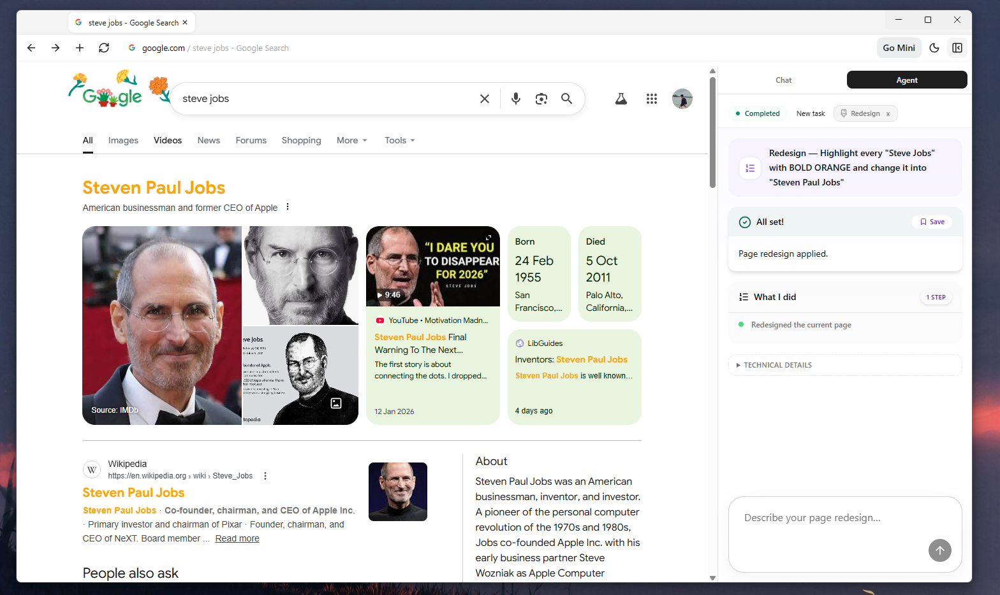
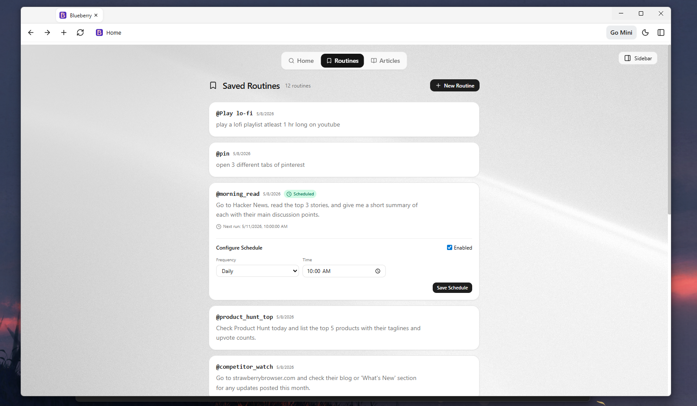
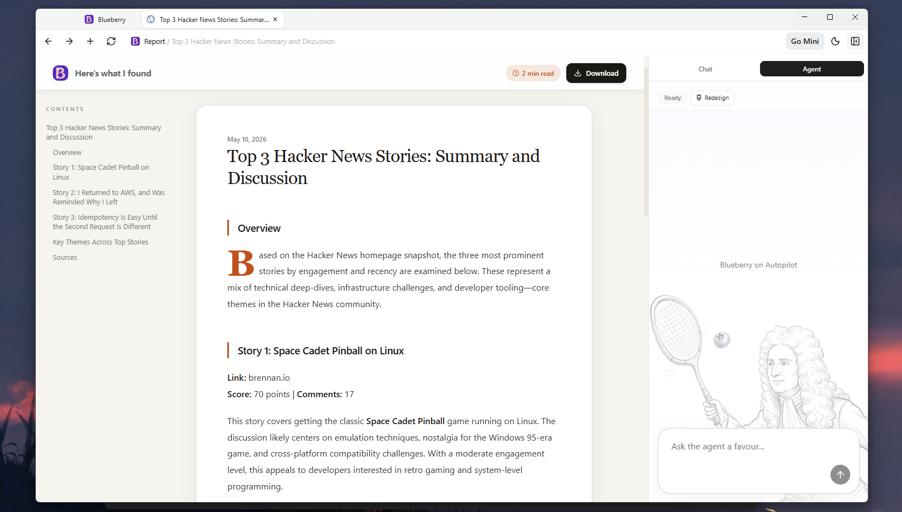
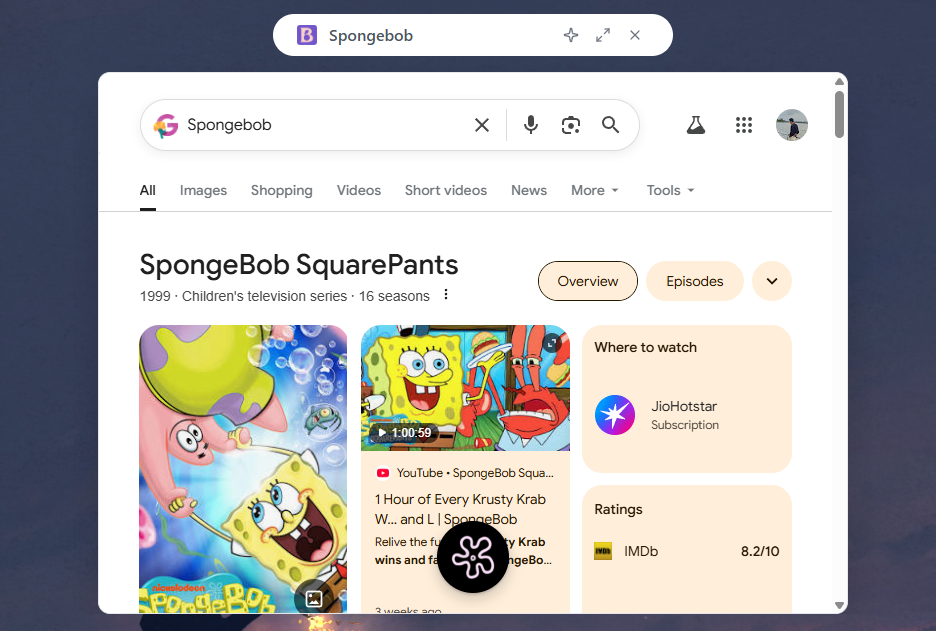
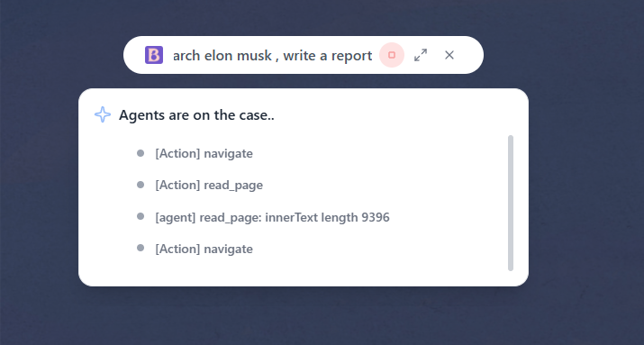

# Blueberry - What I Built

This is the new Blueberry. Here's everything I added, how it works, and where to find it in the code.

---

## Features Added

1. [Home Page](#1-home-page)
2. [Browser Control Agent](#2-browser-control-agent)
3. [Redesign Agent](#3-redesign-agent)
4. [Routines — Save & Schedule Agent Tasks](#4-routines--save--schedule-agent-tasks)
5. [Analysis & Report Generation](#5-analysis--report-generation)
6. [Mini Dock Mode](#6-mini-dock-mode)
7. [Headless Agent for Mini Mode](#7-headless-agent-for-mini-mode)
8. [Proactive Agents *(Experimental)*](#8-proactive-agents-experimental)

---

## 1. Home Page

**Files:** `src/renderer/home/src/HomeApp.tsx`, `src/main/homePage.ts`, `src/preload/home.ts`

The home page is what loads when you open a new tab. It's a React app served as a `WebContentsView` inside the main window, so it has full access to Electron IPC.



It has three tabs across the top:

- **Home** — a search bar with two modes: *Search* (navigates to Google or a URL) and *Agent* (sends the query straight to the sidebar agent panel). The backdrop image gives it some character.
- **Routines** — shows saved routines, lets you create new ones, run them, schedule them, delete them. More on this in the Routines section.
- **Articles** — lists all saved research reports. Click one and it opens in a new tab.

The `homeAPI` preload exposes a small set of IPC calls the home page needs — `navigateFromSearch`, `openSidebarWithAgent`, `toggleSidebar`, `listReports`, `openReport`. It guards every call with an `isHomePage()` check so external sites can't invoke these even if they somehow get the preload.

One thing worth noting: `navigateFromSearch` goes through `home-navigate` in the main process, which re-checks that the sender is actually the home tab before doing anything. This prevents random pages from hijacking navigation via a stale preload.

---

## 2. Browser Control Agent

**Files:** `src/main/AgentRunner.ts`, `src/main/agent/agentExecute.ts`, `src/main/agent/agentPrompts.ts`, `src/main/agent/agentSchema.ts`, `src/main/AgentChromeOverlay.ts`, `src/renderer/sidebar/src/components/AgentPanel.tsx`

This is the main feature. You give the agent a goal in plain English, it takes over the browser and gets it done.



### How the loop works

The agent runs a while loop inside `AgentRunner.run()`. Each iteration:

1. Takes a screenshot of the active tab (if vision mode is on)
2. Builds a user message with the goal, full action history, current URL/title, and a page snapshot if a `read_page` was just done
3. Calls the LLM and asks for a single JSON action
4. Parses and validates the action via Zod
5. Executes it via `agentExecute.ts`
6. Appends to history and loops

The loop ends when the agent returns `{"action":"done"}`, hits the step limit (60 by default), or is manually stopped.

### Two prompt modes

There are two system prompts — `SYSTEM_BLIND` and `SYSTEM_VISION` in `agentPrompts.ts`.

- **Blind mode** is used until the agent calls `{"action":"see"}` for the first time. At that point, every subsequent round attaches a real screenshot and switches to `SYSTEM_VISION`.
- **Vision mode** gives the agent access to `click_xy`, `type`, `scroll`, and `press_enter`. It also gets the screenshot dimensions so it can calculate where to click.

The reason for two modes is cost and effectiveness. In a lot of prompts, the agent was getting lost of it actual reasoning on seeing a completely unrelated webpage screenshot.

### JSON repair

LLMs sometimes respond with prose or half-formed JSON even when you explicitly ask for pure JSON. `parseOrRepairAgentStep` tries to parse the output first, and if that fails, fires a second LLM call with `COERCE_SYSTEM` — a minimal prompt that just says "turn this into one valid JSON action object." This keeps the agent from crashing on minor model verbosity without needing to write a complex parser.

### Click coordinate scaling

Screenshots are captured at device pixel ratio resolution. The agent returns `click_xy` coordinates in screenshot pixel space. Before sending the actual input event, `agentExecute.ts` scales them to CSS viewport coordinates:

```
xCss = (xImg / shotW) * viewW
```

Then `Tab.clickAtCss()` sends real `mouseDown`/`mouseUp` input events — not DOM-simulated clicks — which matters for sites that use pointer event listeners instead of click handlers.

### Typing into React inputs

Normal `element.value = "..."` doesn't trigger React state updates because React intercepts the setter. The agent uses a custom injected script (`buildTypeIntoActiveElementScript`) that uses the internal property descriptor setter and fires `input` + `change` events, so React picks up the change correctly. Handles `<input>`, `<textarea>`, and `contenteditable` elements.

### The glow overlay

While the agent is running, `AgentChromeOverlay` adds an animated orange border around the content area. It's a separate `WebContentsView` sitting above the tab views in the z-order. Key detail: it uses `setIgnoreMouseEvents(true, { forward: true })` so all clicks still pass through to the actual tab underneath — the border is purely visual.

### The sidebar Agent panel

The sidebar's Agent rail (`AgentPanel.tsx`) shows:
- The current goal in a request card
- A step log with human-readable labels (e.g. "Opened google.com", "Read page text from the tab")
- A conclusion card once the agent finishes with a **Save** button to turn the run into a Routine
- Report links if a research report was generated
- A collapsible technical log for debugging
- `@mention` autocomplete for saved routines in the composer

---

## 3. Redesign Agent

**Files:** `src/main/agent/mutateRunner.ts`, `src/renderer/sidebar/src/components/AgentPanel.tsx` (Redesign toggle)

Separate from the browser agent. This one is simpler — you describe what you want changed on the current page, and it generates JavaScript that mutates the live DOM in place.



The flow:
1. User toggles **Redesign** mode in the sidebar header and types an instruction
2. `mutateRun` IPC call fires
3. `mutateRunner.ts` grabs the current page's full HTML and visible text
4. Sends both plus the instruction to the LLM with `REDESIGN_SYSTEM` — a prompt that says "output only JS, no markdown fences, safe to run multiple times, no fetch/network calls"
5. The JS is wrapped in an async IIFE and executed via `tab.runJs()`
6. The script's return value is shown as the result message in the sidebar

The prompt is strict about sticking to pure DOM/CSS changes — hide elements, restyle things, inject a readable view, translate labels, etc. Scripts tag their changes with `data-blueberry-redesign` attributes so repeated runs can clean up their own previous state.

This is intentionally a single-shot call rather than an agent loop. Redesigns don't need iterative browsing — just one smart code generation step.

---

## 4. Routines — Save & Schedule Agent Tasks

**Files:** `src/main/agent/routineStorage.ts`, `src/main/agent/scheduler.ts`, `src/renderer/home/src/HomeApp.tsx` (Routines tab), `src/renderer/sidebar/src/components/AgentPanel.tsx` (@mention), `src/main/EventManager.ts` (IPC handlers)

Once an agent run succeeds, you can save the goal as a named Routine. Routines are stored agent prompts with a short name you can reference later with `@`.



### Saving and running

After a successful agent run the sidebar shows a **Save** button next to "All set!". You give it a short name (e.g. `linkedin_update`) and it's stored to disk at `userData/blewberry/routines.json`.

From then on, you can type `@linkedin_update` in any agent composer and the sidebar expands it to the full original query before sending. The `@mention` dropdown fires live as you type, filters matching routines, and inserts on click.

### Scheduling

From the Routines tab on the home page, each routine has a clock button that opens a schedule editor inline. Options:

- **Hourly** — runs every hour
- **Daily** — pick a time (HH:MM)
- **Weekly** — pick a day and time

The `nextRun` timestamp is calculated and stored on the routine. `RoutineScheduler` in `scheduler.ts` polls every 60 seconds, checks if any routine's `nextRun` has passed, fires a `HeadlessAgent` for it, then recalculates the next run time. The scheduler starts automatically in `index.ts` on app launch and runs completely silently.

Routine data shape (in `routineStorage.ts`):

```typescript
interface Routine {
  id: string
  name: string
  query: string
  createdAt: string
  schedule?: { type: "hourly" | "daily" | "weekly", time?, dayOfWeek?, enabled }
  lastRun?: string
  nextRun?: string
}
```

---

## 5. Analysis & Report Generation

**Files:** `src/main/agent/reportWriter.ts`, `src/main/agent/agentReportStorage.ts`, `src/renderer/report/src/ReportApp.tsx`, `src/main/reportPage.ts`

When the agent is doing research-style tasks, it calls `save_report` on important pages. Each call stores the current tab's text into a `reportSegments` array in the runner. After the agent finishes, the report pipeline kicks off automatically:



```
reportSegments → generateResearchReportMarkdown() → saveAgentReport() → new tab opens
```

### The report writer

`generateResearchReportMarkdown()` sends all the saved page bodies plus the original goal to the LLM with a detailed `REPORT_SYSTEM` prompt. That prompt tells the model to produce one clean Markdown document — proper heading hierarchy, paragraph breaks, bullet lists, tables where useful, blockquotes for direct excerpts, and a Sources section at the end. Temperature is set to 0.35 so it's grounded but not robotically dry.

The title is extracted from the first H1 heading in the output.

### Storage

Reports are saved as JSON files in `userData/agent-reports/<uuid>.json`. They contain `id`, `title`, `markdown`, and `createdAt`. The report viewer gets the ID from the URL query string and loads the file via IPC. No server involved — everything is local.

### The report viewer

`ReportApp.tsx` is a proper reading experience:
- Sticky table of contents built by parsing the markdown headings, with `IntersectionObserver` tracking the active section as you scroll
- Drop-cap on the first paragraph via CSS `::first-letter`
- Animated H2 headings that slide in on load
- Estimated read time (word count / 200)
- PDF export via Electron's `printToPDF` — hides chrome elements with `@media print` CSS
- Back-to-top button that appears after 600px of scroll
- The report lives at a special internal URL (`/report/?id=...`) that only the report page preload can load data from

---

## 6. Mini Dock Mode

**Files:** `src/main/MiniWindow.ts`, `src/renderer/mini/src/MiniApp.tsx`, `src/preload/mini.ts`

Mini Mode is a compact floating window (800×60px) that sits at the top of your screen. Hit "Go Mini" in the topbar and the main window hides — the mini pill takes over.



The pill has:
- A text input for search or agent queries
- A sparkle icon to toggle agent mode
- An expand-to-main button (brings back the full browser; if a URL was loaded in the mini webview it transfers over)
- A close/quit button

### Search mode

In search mode, submitting expands the window to 600px tall and loads the result in an embedded `<webview>` tag. The webview URL syncs back to the input so you can see where you are. Clicking expand-to-main transfers the current webview URL to a tab in the main window.

### Agent mode

In agent mode, the window expands to 300px and shows the headless agent's live log while it works. Once done, a conclusion + "Open Full Report" button appears. Tapping it switches to a full report view rendered inline via `MiniReport.tsx` — same styling as the main report viewer, just embedded in the mini window.

The mini window is frameless and transparent — the pill shape is all CSS `border-radius` with a white/dark background.

---

## 7. Headless Agent for Mini Mode

**Files:** `src/main/agent/headlessAgent.ts`

The main `AgentRunner` depends on a visible browser tab with real screenshots. That doesn't work in Mini Mode — there's no visible tab to capture, and showing one would defeat the whole point of the compact HUD.

`HeadlessAgent` is a stripped-down agent that uses only text-based actions: `navigate`, `read_page`, `save_report`, and `done`. No screenshots, no clicking.




Key differences from the main agent:
- Runs on a hidden `Tab` (`about:blank`) that's created in memory but never added to any window
- Only uses `SYSTEM_BLIND` — vision mode is never triggered
- Visual actions (`see`, `click_xy`, `type`, `scroll`, `press_enter`) are silently skipped rather than erroring
- Default max 10 steps — fast and focused
- The prompt strongly discourages over-research: save 1–2 pages max, then call done

The hidden tab is created at the start of the run and destroyed in a `finally` block regardless of outcome.

The scheduler uses this same `HeadlessAgent` for all scheduled routine runs — a routine fires silently in the background, generates a report if applicable, and you'll find it in Articles next time you open the home page.

---

## 8. Proactive Agents *(Experimental)*

**Branch:** `proactive`

Not merged to main yet. The idea is agents that trigger on a condition rather than on demand — "notify me when a price drops below X", "summarize new items in this feed every morning", etc.

The scheduling infrastructure from the Routines feature is the foundation here. The proactive branch extends it with event-driven and condition-based triggers beyond just time schedules. Still being worked out.

---

## Quick File Reference

| What you're looking for | Where it is |
|---|---|
| Agent loop | `src/main/AgentRunner.ts` |
| What each action actually does | `src/main/agent/agentExecute.ts` |
| System prompts (BLIND / VISION / COERCE) | `src/main/agent/agentPrompts.ts` |
| Action schema + JSON repair | `src/main/agent/agentSchema.ts` |
| Report generation LLM call | `src/main/agent/reportWriter.ts` |
| Report file storage (read/write/list) | `src/main/agent/agentReportStorage.ts` |
| Page mutation / Redesign | `src/main/agent/mutateRunner.ts` |
| Routine storage | `src/main/agent/routineStorage.ts` |
| Background scheduler | `src/main/agent/scheduler.ts` |
| Headless agent | `src/main/agent/headlessAgent.ts` |
| All IPC handlers wired up | `src/main/EventManager.ts` |
| Glow overlay during agent runs | `src/main/AgentChromeOverlay.ts` |
| Sidebar agent UI | `src/renderer/sidebar/src/components/AgentPanel.tsx` |
| Report viewer UI | `src/renderer/report/src/ReportApp.tsx` |
| Home page UI | `src/renderer/home/src/HomeApp.tsx` |
| Mini mode UI | `src/renderer/mini/src/MiniApp.tsx` |