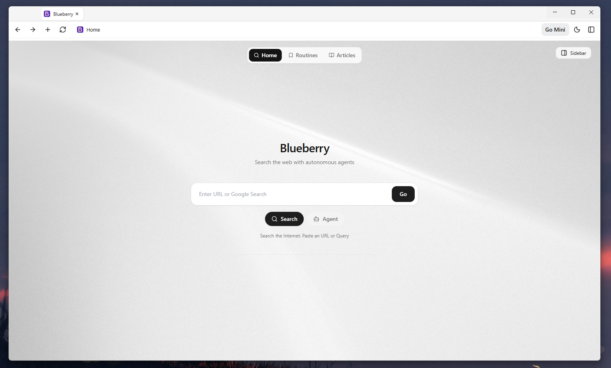
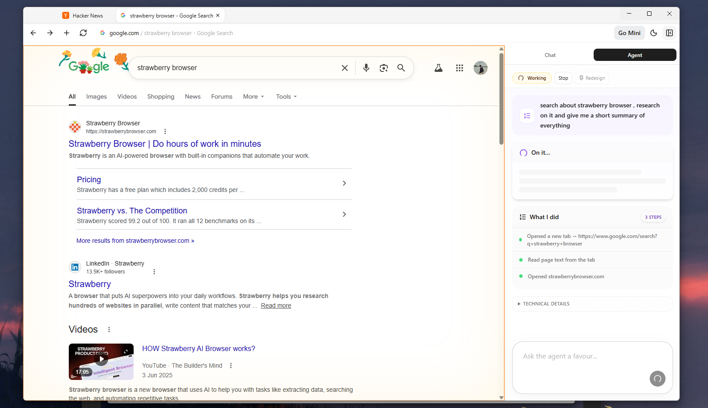
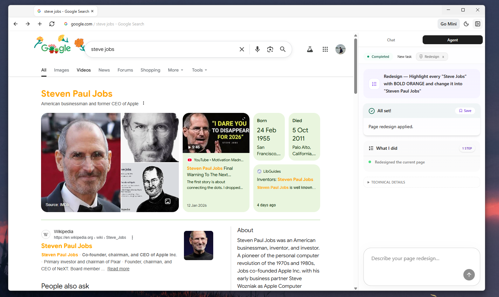
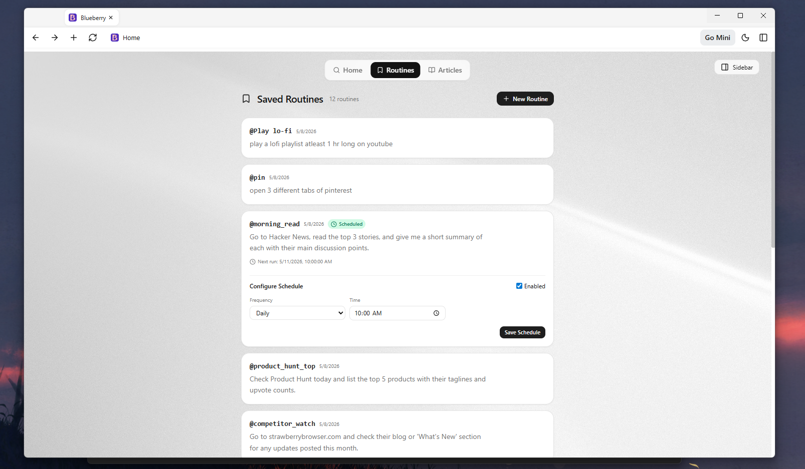
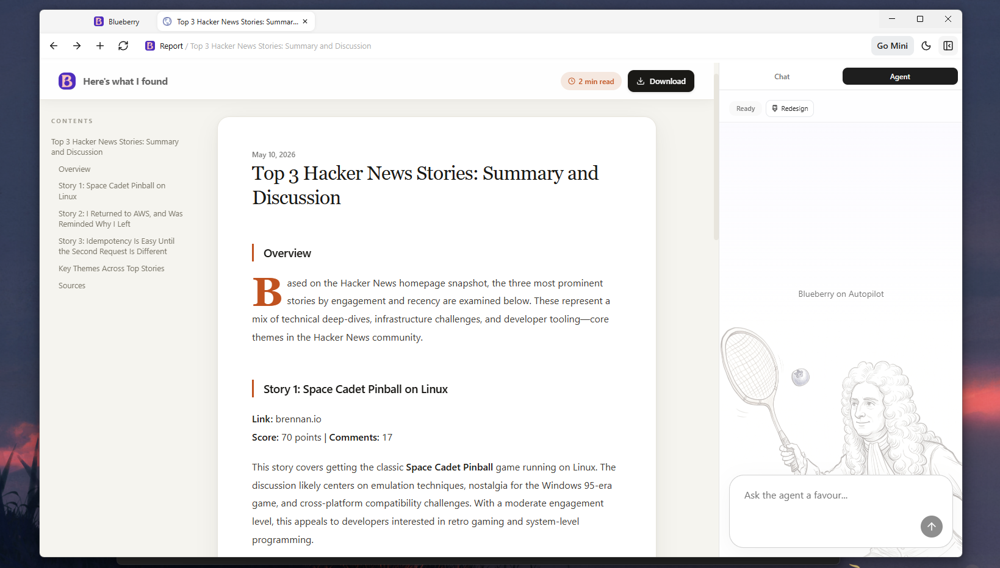
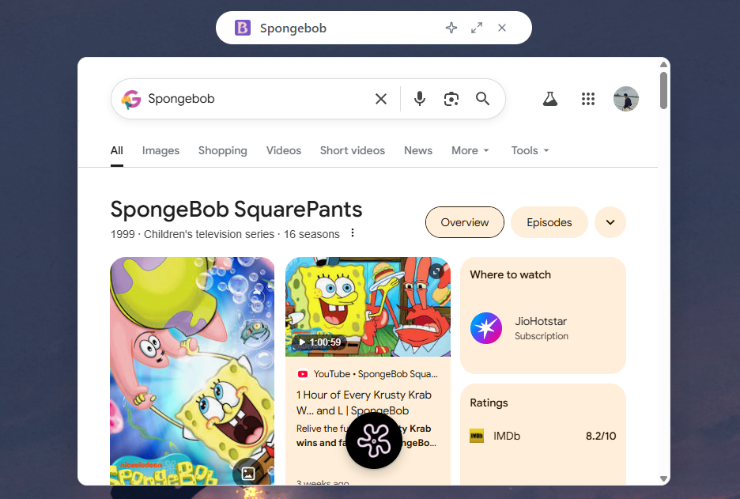

<div align="center">

# Blueberry Browser

### a browser where the AI can actually drive

Give it a task. Watch what it does.

<br />



<br />

**[What is this?](#what-is-this)** · **[Give it a job](#give-it-something-meaty)** · **[Run it](#run-it-locally)** · **[Under the hood](#under-the-hood)**

</div>

---

## What is this?

Having an AI answer a question in a chat box is nice, but having it actually use the browser is way more interesting.

You give it something to do. It can open pages, move around, read stuff, type, click, open tabs, and keep going until it thinks the job is done. You can sit there and watch the steps roll in, kill the run, or jump back in yourself whenever you feel like it.


> Think: a browser with eyes, hands, a little bit of initiative, and way fewer excuses.

## Give it something meaty

The little one-line tasks are fine, but they are not really the point. Blueberry gets interesting when the request has a bunch of moving parts—the sort of thing that normally ends with fifteen tabs, half-finished notes, and “I’ll come back to this later.”

Try prompts like these:

> **“I’m planning a trip to Tokyo in November. Find the best direct flight options from Bangalore, compare the trade-offs between the top three, look up where they land, and find a well-reviewed hotel near the most convenient airport. Save the important pages and give me a short plan.”**

> **“I’m deciding whether to use Linear, Height, or Jira for a five-person product team. Go through their official pricing and feature pages, figure out what each one costs at that size, call out the stuff that will annoy a small team, and recommend one. Keep the sources so I can check your work.”**

> **“Read this long article, clean up the page so it is actually readable, find the original sources behind its biggest claims, and give me the version I should send to a friend who does not have ten minutes.”**

> **“I need to understand how this library handles authentication. Start from its docs, find the setup guide, the API reference, and any migration notes. Tell me the shortest path to get it working in an existing app, plus the gotchas that will probably waste my afternoon.”**

> **“Every weekday morning, check these competitors for new product launches, pricing changes, or big announcements. Save the useful sources, and leave me a quick briefing if anything actually changed.”**

That is the whole reason for autonomous browsers: not another chat box that tells you where to click, but software that can take the messy middle of browser work off your plate. Blueberry is already set up for long, multi-step jobs; clearer goals and a little supervision make it much more reliable on real sites.

## So how does it pull that off?

### ⚡ Tell it what to do

The Agent tab in the sidebar is the main thing. Drop in a goal like:

> “Open Hacker News, find the top post about AI, and tell me why people care.”

The agent works one move at a time. It gets the current page, chooses an action, does it, then figures out the next move. You get a normal step list instead of some mysterious spinner pretending nothing is happening.

<p align="center">
  
</p>

It can currently:

| | |
| --- | --- |
| **Open things** | Navigate to a URL or spin up a new tab. |
| **Look around** | Take a screenshot of the current page when visual context matters. |
| **Use the page** | Click, type, scroll, and press Enter in the active tab. |
| **Read the page** | Pull out visible page text when it needs actual details. |
| **Wrap up** | Give you a plain-English summary when it is finished. |

### 🎨 Make ugly pages less annoying

There is a Redesign mode for when a page is technically useful but visually cursed.

Tell it to clean up a cluttered article, make something easier to read, pull attention to a section, or generally calm the page down. It generates a one-off DOM/CSS change and applies it right there in the tab.

Reload the page and the change is gone. No permanent weirdness.

<p align="center">
  
</p>

### ↻ Save a task, run it again

If a task works well, save it as a routine. Give it a short name and call it later with `@routine_name` from the agent box.

You can also put routines on an hourly, daily, or weekly schedule. They run through the headless agent while the app is open, so Blueberry can handle the boring repeat stuff without opening a whole browser window in your face.

<p align="center">
  
</p>

### 📝 Reports, when a task deserves one

Sometimes you do not just want “done.” You want the useful bits saved somewhere you can come back to.

While it is browsing, the agent can save source pages. If it has saved anything, a separate report-writing pass can turn those captures into a proper Markdown report. The report lives on your machine, shows up in **Articles**, and has a reader with a table of contents plus PDF export.

That is great for comparisons, research, planning, and recurring briefings. For everything else, the agent can just do the task and get out of the way.

<p align="center">
  
</p>

### ◌ Mini Mode

Mini Mode is the tiny floating version of Blueberry. Handy when you want to search something, kick off a quick agent task, and keep your actual desktop usable.

It can expand into a little browser view, or show the agent’s live steps and a tiny preview of the page it is working on. Hit the expand button when you want to bring the result back to the main window.

<p align="center">
  
</p>

## Under the hood

Blueberry is Electron + React + TypeScript. The browser itself is made from Electron `WebContentsView`s: tabs are separate from the top bar, sidebar, Home screen, report reader, and Mini Mode. It makes the app feel more like a browser than a website pretending to be one.

The normal browser agent is deliberately built around a small list of actions instead of “LLM, here is arbitrary JavaScript, good luck.” It can navigate, read, use screenshots, click/type/scroll, save source material, and finish. Those actions are checked with Zod before they run.

There are a few different agent-shaped pieces in here:

```text
Your goal
   │
   ├─ visible browser agent ── drives the active tab and streams steps to the sidebar
   ├─ headless agent ───────── handles Mini Mode and scheduled routines
   └─ report writer ────────── only joins in when saved sources should become a report
```

That last one matters: the report writer is a specialist, not the boss of the app.

### Where stuff lives

| What | Where to look |
| --- | --- |
| App/window setup | `src/main/index.ts`, `src/main/Window.ts` |
| Tabs | `src/main/Tab.ts` |
| IPC wiring | `src/main/EventManager.ts` |
| Main browser agent | `src/main/AgentRunner.ts` |
| Agent actions | `src/main/agent/agentSchema.ts`, `src/main/agent/agentExecute.ts` |
| Prompts | `src/main/agent/promptBuilder.ts` |
| Reports | `src/main/agent/reportWriter.ts`, `src/main/agent/agentReportStorage.ts` |
| Routines/schedules | `src/main/agent/routineStorage.ts`, `src/main/agent/scheduler.ts` |
| Mini Mode | `src/main/MiniWindow.ts`, `src/renderer/mini/` |
| Sidebar agent UI | `src/renderer/sidebar/src/components/AgentPanel.tsx` |

Reports and routines are local files under Electron’s user-data directory:

- Reports: `userData/agent-reports/<uuid>.json`
- Routines: `userData/blewberry/routines.json`

There is no Blueberry account, cloud sync, collaboration layer, or semantic-history feature in this branch.

## Run it locally

You will need Node.js 22+ and either an Anthropic or OpenAI API key.

```bash
git clone https://github.com/Rhishavhere/blueberry
cd blueberry
corepack enable
pnpm install
cp .env.example .env
```

Put a provider and key in `.env`.

```dotenv
# Anthropic
LLM_PROVIDER=anthropic
ANTHROPIC_API_KEY=your_key_here
AGENT_MODEL=claude-haiku-4-5-20251001
```

Or:

```dotenv
# OpenAI
LLM_PROVIDER=openai
OPENAI_API_KEY=your_key_here
AGENT_MODEL=gpt-4o-mini
```

Then run it:

```bash
pnpm dev
```

`pnpm` is the preferred package manager because the repo has a `pnpm-lock.yaml`. `npm install` is fine too if that is what you use.

| Command | What it does |
| --- | --- |
| `pnpm dev` | Starts the app in dev mode. |
| `pnpm typecheck` | Checks the main and renderer TypeScript projects. |
| `pnpm lint` | Runs ESLint. |
| `pnpm format` | Lets Prettier tidy everything up. |
| `pnpm build` | Typechecks, then builds the app. |
| `pnpm build:win` | Builds the Windows installer. |
| `pnpm build:mac` / `pnpm build:linux` | Builds macOS or Linux packages. |

## A quick reality check

This is browser automation. That means it can get confused, pages can change, and it can absolutely make bad calls if you ask it to do something vague or high-stakes.

- Watch runs that touch logged-in accounts, forms, money, publishing, or anything hard to undo.
- Do not treat an agent summary as proof. Check the page and the sources when it matters.
- Redesign mode runs model-generated JavaScript in the page you currently have open. Use it on pages you trust; reload to wipe its changes.
- Scheduled routines run while Blueberry is open. They are handy, but this is not a production job queue or monitoring platform.
- Your model provider gets the prompts, screenshots, and page excerpts needed for the job. Do not send sensitive material without understanding that provider’s policies.

## Notes for people hacking on it

The renderer surfaces each have their own preload entry point: top bar, sidebar, Home/report pages, Mini Mode, and the agent overlay. IPC is wired in `src/main/EventManager.ts`.

Keep renderer APIs tiny. Validate requests in the main process. Be very careful about which pages get privileged capabilities. Browsers are a weird place to be casual about trust boundaries.

There is also a deeper [architecture review](docs/review.md) in the repo with the rough edges, design notes, and next things worth fixing.

---

<div align="center">

### 🫐 Blueberry Browser

**A browser tab is usually where work starts. This is for helping it finish.**

</div>
